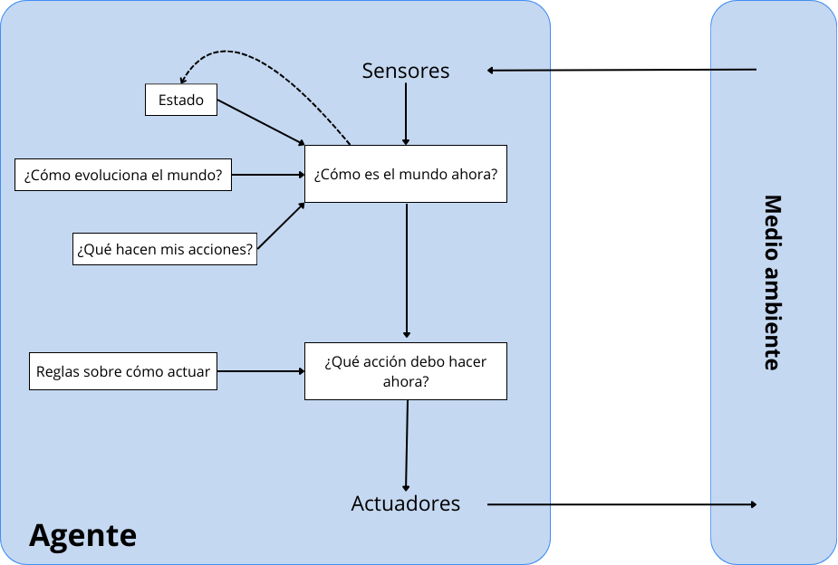

# Agente Inteligente RPSLS

## 1. Especificación del Entorno de Tareas

| **Entorno de tareas** | **Completamente/ Parcialmente Observable** | **Agentes** | **Determinista/ Estocástico** | **Episódico/ Secuencial** | **Estático/ Dinámico** | **Discreto/ Contínuo** | **Conocido/ Desconocido** |
|------------------------|----------------|-------------|------------------|---------------|--------------|--------------|--------------|
| **RPSLS**             | Parcialmente   | Multi-agente | Determinista    | Secuencial     | Estático     | Discreto     | Conocido    |

### Justificación de las características:
- **Observable:** El juego es parcialmente observable ya que cada jugador conoce su propia acción, pero no la del contrincante hasta que se resuelve la partida.
- **Agentes:** Es un entorno multi-agente porque participan dos jugadores.
- **Determinista:** El entorno es determinista porque el resultado está completamente determinado por las acciones de los jugadores, sin elementos de azar.
- **Secuencial:** El agente tiene memoria y utiliza el historial de partidas anteriores para tomar decisiones. Las acciones actuales dependen de estados previos, lo que hace que las partidas no sean independientes.
- **Estático:** El entorno no cambia durante una partida, y las decisiones de los jugadores no están afectadas por elementos externos.
- **Discreto:** Las acciones disponibles (piedra, papel, tijeras, lagarto, Spock) son discretas y limitadas.
- **Conocido:** Las reglas del juego son conocidas por ambos jugadores.

---

## 2. Identificación del Tipo de Agente y Estructura

### Tipo de Agente Seleccionado:
**Agente reactivo basado en modelos.**

### Estructura del Agente:
Es un agente reactivo basado en modelos ya que utiliza memoria para construir un modelo del comportamiento del oponente y toma decisiones inmediatas basadas en este modelo, sin planificación a largo plazo ni optimización compleja de utilidad.

