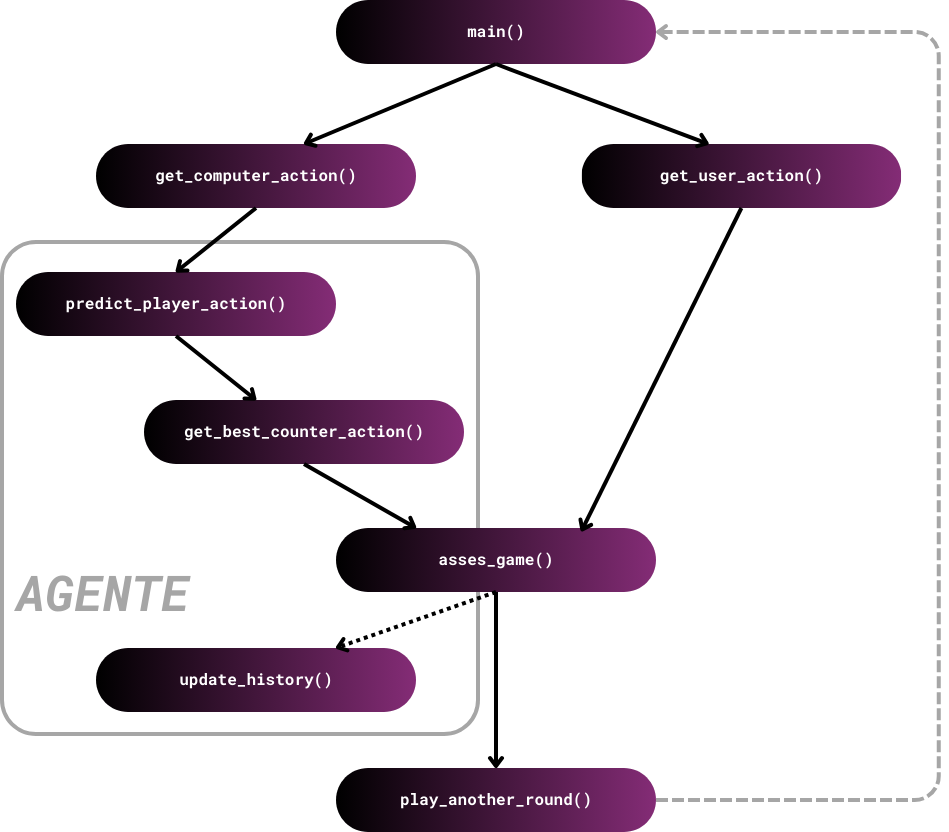

# Agente Inteligente RPSLS

## 1. Especificación del Entorno de Tareas

| **Entorno de tareas** | **Completamente/ Parcialmente Observable** | **Agentes** | **Determinista/ Estocástico** | **Episódico/ Secuencial** | **Estático/ Dinámico** | **Discreto/ Contínuo** | **Conocido/ Desconocido** |
|------------------------|----------------|-------------|------------------|---------------|--------------|--------------|--------------|
| **RPSLS**             | Parcialmente   | Multi-agente | No determinista    | Secuencial     | Estático     | Discreto     | Conocido    |

### Justificación de las características:
- **Observable:** El juego es parcialmente observable ya que cada jugador conoce su propia acción, pero no la del contrincante hasta que se resuelve la partida.
- **Agentes:** Es un entorno multi-agente porque participan dos jugadores.
- **No determinista:** El entorno es no determinista porque el resultado puede variar según las acciones de los jugadores.
- **Secuencial:** El agente tiene memoria y utiliza el historial de partidas anteriores para tomar decisiones. Las acciones actuales dependen de estados previos, lo que hace que las partidas no sean independientes.
- **Estático:** El entorno no cambia durante una partida, y las decisiones de los jugadores no están afectadas por elementos externos.
- **Discreto:** Las acciones disponibles (piedra, papel, tijeras, lagarto, Spock) son discretas y limitadas.
- **Conocido:** Las reglas del juego son conocidas por ambos jugadores.

---

## 2. Identificación del Tipo de Agente y Estructura

### Tipo de Agente Seleccionado:
**Agente reactivo basado en modelos.**

### Estructura del Agente
Es un agente reactivo basado en modelos ya que utiliza memoria para construir un modelo del comportamiento del oponente y toma decisiones inmediatas basadas en este modelo, sin planificación a largo plazo ni optimización compleja de utilidad.


### Componentes de la Estructura:
1. **Percepción:** La entrada del agente incluye la acción del jugador humano (o contrincante).
2. **Modelo interno:** El agente mantiene un historial de juegos previos para inferir patrones del jugador humano.
3. **Función de decisión:** El agente calcula la mejor acción basada en el historial y en la estrategia de maximización de rendimiento.
4. **Salida:** La acción seleccionada por el agente para maximizar el rendimiento.

### Para seguir esta estructura, he desarrollado un Agente que sigue el siguiente flujo:



### Funcionamiento del Agente
1. Inicializa un historial de jugadas propias, del adversario y de los resultados (`__init__()`).
2. Intenta predecir la siguiente jugada del adversario en base al historial guardado usando ponderaciones (`predict_player_action()`).
3. Busca la mejor jugada para contrarrestar la predicción que ha hecho. En el caso de que detecte 2 jugadas seguidas iguales con resultado negativo para el agente por parte del adversario, para evitar una predicción del funcionamiento del algoritmo, y siguiendo el modelo de Márkov, el agente cogerá esa jugada y jugará un counter para la misma (`get_best_counter_action()`).
4. Actualiza los historiales de las jugadas (`update_history()`).


### Instalación y ejecución del proyecto
Para la instalación y ejecución del proyecto, debemos seguir los siguientes pasos:
1. **Clonar el repositorio**  
Abre una terminal y ejecuta el siguiente comando para clonar el repositorio en tu máquina local:
```bash
git clone https://github.com/MiBasDev/RPS.git
```
2. **Navega al directorio del proyecto** 
```bash
cd RPS/src
```
3. **Crear un entorno virtual (opcional pero recomendado)** 
```bash
python -m venv env
```
4. **Ejecutar el proyecto** 
```bash
python app.py
```